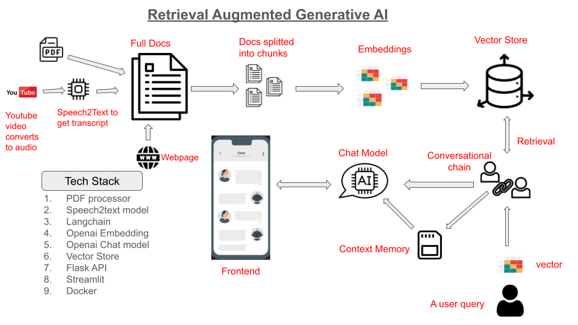

# RAG AI (Retrieval Augmented Generative AI)

RAG AI is a cutting-edge application that marries a Flask backend with a Streamlit frontend, creating a dynamic and interactive user experience. At its core, RAG AI is built upon the principles of Retrieval Augmented Generative AI, a powerful approach that combines the capabilities of generative AI models with information retrieval techniques. This method enhances the AI's responses by grounding them in a set of dynamically retrieved documents, leading to more accurate and informed answers.

In RAG AI, we have integrated OpenAI's advanced embedding and chat models to facilitate meaningful interactions and responses. The application leverages OpenAI's embeddings to transform documents into rich, machine-understandable representations, enabling efficient similarity searches and information retrieval. Coupled with OpenAI's conversational models, RAG AI provides a seamless chat experience that can handle complex queries and engage users in meaningful dialogues.

We have utilized the LangChain framework extensively to build and optimize the retrieval mechanisms, prompts, and conversational chains. LangChain provides a flexible and powerful toolkit for crafting conversational AI experiences, allowing RAG AI to harness the best of language models and document retrieval strategies.

RAG AI is adept at processing and indexing various types of multimedia content, including PDF documents, YouTube videos, and web content.

## Main Features

- Interactive AI chat interface.
- Ability to upload, process, and index PDF documents.
- Indexing from YouTube videos. This converts the video to audio and then trancribes the audio to text
- Extracting and indexing web page content.

## Getting Started



### Prerequisites

- Python 3.10 or higher.
- Docker (optional for Docker deployment).

### Installation and Setup

#### Local Setup

1. **Clone the Repository:**

   ```bash
   git clone https://github.com/ConceptualCode/RAG.git
   cd RAG-AI


2. Install Dependencies:

   ```bash
   pip install -r requirements.txt

3. Set Environment Variables:
   Create a .env file in the root directory and add your OpenAI API key:

   OPENAI_API_KEY=YourOpenAIKeyHere

   Make a dir docs/chroma in the root directory

4. Make sure you have FFmpeg

5. Run the Flask Backend:
   ```bash
   python app.py

6. Run the Streamlit Frontend:
   ```bash
   streamlit run streamlit_app.py


## Using Docker

### 1. Pull the Docker Images
#### For the Flask backend:

    ```bash
    docker pull tonysoro/rag-backend

#### For the Streamlit frontend:

    ```bash
    docker pull tonysoro/rag-frontend

### 2. Run containers
    ```bash
    docker run --env-file .env -p 5000:5000 tonysoro/rag-backend
    docker run --env-file .env -p 8501:8501 tonysoro/rag-frontend

Ensure you have an .env file with your OpenAI API key:
    ```bash
    OPENAI_API_KEY=your_openai_api_key_here

### Usage
Access the Streamlit interface at http://localhost:8501 to interact with the chatbot, upload PDFs, index YouTube audio, or extract web content. The Flask backend will process and respond to your requests.


#### References and Acknowledgments

This project leverages several exceptional open-source tools and resources. Special thanks to the following for their significant contributions to the development of RAG AI:

- **LangChain Documentation**: Essential guidance and tools for building conversational AI applications were provided by the LangChain documentation. [LangChain Documentation](https://langchain.readthedocs.io/)

- **Flask Documentation**: Flask was pivotal in developing the backend for this application. The Flask documentation offered crucial insights for creating robust web applications. [Flask Documentation](https://flask.palletsprojects.com/)

- **Streamlit Documentation**: Streamlit's user-friendly approach to building data applications was key in developing RAG AI's frontend. The Streamlit documentation was an invaluable resource for UI development. [Streamlit Documentation](https://docs.streamlit.io/)

- **Docker Documentation**: Docker played a crucial role in containerizing the application, ensuring its portability and ease of deployment. The Docker documentation provided essential guidance on containerization and orchestration. [Docker Documentation](https://docs.docker.com/)


