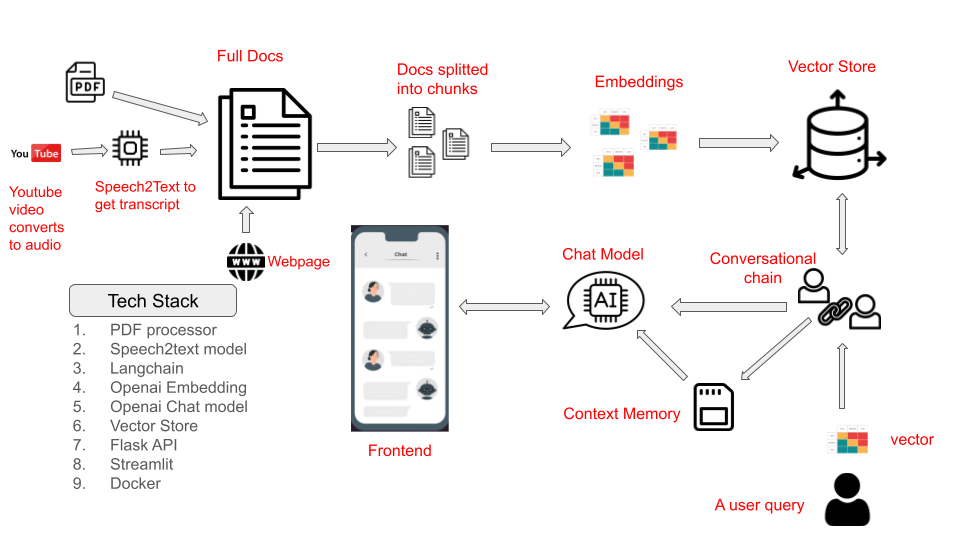

# RAG AI (Retrieval Augmented Generative AI)

RAG AI is a robust application combining a Flask backend with a Streamlit frontend. It's designed to interactively chat with users, process and index documents, and handle multimedia content such as PDFs, YouTube videos and Web contents.

## Main Features

- Interactive AI chat interface.
- Ability to upload, process, and index PDF documents.
- Indexing from YouTube videos. This converts the video to audio and then trancribes the audio to text
- Extracting and indexing web page content.

## Getting Started



### Prerequisites

- Python 3.10 or higher.
- Docker (optional for Docker deployment).

### Installation and Setup

#### Local Setup

1. **Clone the Repository:**

   ```bash
   git clone https://github.com/ConceptualCode/RAG.git
   cd RAG-AI


2. Install Dependencies:

   ```bash
   pip install -r requirements.txt

3. Set Environment Variables:
   Create a .env file in the root directory and add your OpenAI API key:

   OPENAI_API_KEY=YourOpenAIKeyHere

   Make a dir docs/chroma in the root directory

4. Run the Flask Backend:
   ```bash
   python app.py

5. Run the Streamlit Frontend:
   ```bash
   streamlit run streamlit_app.py


## Using Docker

### 1. Pull the Docker Images
#### For the Flask backend:


   docker pull tonysoro/rag-backend

#### For the Streamlit frontend:


docker pull tonysoro/rag-frontend

### 2. Run containers

docker run --env-file .env -p 5000:5000 tonysoro/rag-backend
docker run --env-file .env -p 8501:8501 tonysoro/rag-frontend

Ensure you have an .env file with your OpenAI API key:

OPENAI_API_KEY=your_openai_api_key_here


### Usage
Access the Streamlit interface at http://localhost:8501 to interact with the chatbot, upload PDFs, index YouTube audio, or extract web content. The Flask backend will process and respond to your requests.


